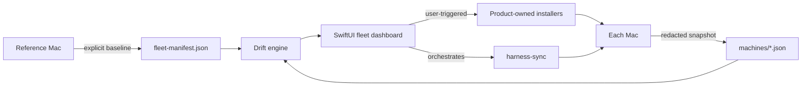

# Device Sync

Device Sync is a native macOS fleet dashboard for Patrick's personal tooling.
It inventories every Mac, compares observed versions and theme fingerprints to
one explicit baseline, and turns drift into a reviewed bootstrap plan.



## What the first release tracks

- ai-continuum CLI and source checkout
- AuthBar, Stow, Murmr Voice, Model Bridge, Codex Desktop, Codex CLI, and
  Codex Voice
- Codex, Warp, and MeshClaw theme sets by filename and SHA-256 fingerprint
- harness-sync revision and local-change posture
- macOS version, build, model identifier, architecture, and snapshot freshness

Snapshots deliberately exclude serial numbers, platform UUIDs, usernames,
absolute source paths, credentials, cookies, tokens, Keychain data, and raw
configuration contents.

## Run and test

```bash
DEVELOPER_DIR=/Applications/Xcode.app/Contents/Developer swift run DeviceSync
DEVELOPER_DIR=/Applications/Xcode.app/Contents/Developer swift test
./install.sh
```

The default shared folder is
`~/Library/CloudStorage/OneDrive-amazon.com/Device Sync` when that OneDrive
root exists. Otherwise Device Sync uses its local Application Support folder.
The folder can be changed in the app.

Headless verification:

```bash
/Applications/Device\ Sync.app/Contents/MacOS/DeviceSync --check
/Applications/Device\ Sync.app/Contents/MacOS/DeviceSync --snapshot
/Applications/Device\ Sync.app/Contents/MacOS/DeviceSync --adopt-baseline
```

The installer registers a per-user LaunchAgent that publishes a snapshot at
login and every six hours. `--adopt-baseline` is an explicit operator action;
scheduled runs never change desired state.

See [docs/ARCHITECTURE.md](docs/ARCHITECTURE.md) for ownership and failure
semantics, and [docs/FLEET-PROTOCOL.md](docs/FLEET-PROTOCOL.md) for the JSON
contract.
