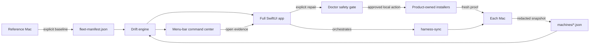
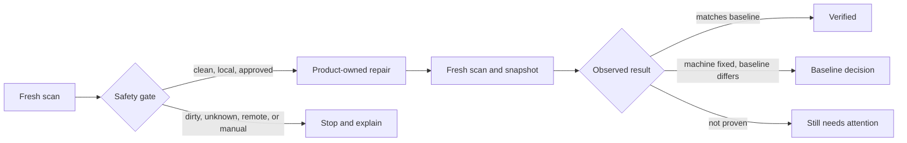

# Device Sync

Device Sync is a native macOS fleet dashboard for Patrick's personal tooling.
It inventories every Mac, compares observed versions and theme fingerprints to
one explicit baseline, and turns drift into guarded repair or a clear decision.

The installed app has two native surfaces backed by the same live state:

- A menu-bar command center for fleet posture, scan freshness, counts, and a
  one-click scan of this Mac.
- A singleton full app for machine evidence, bootstrap planning, settings, and
  Doctor's guarded repair workflow. Menu-bar repair requests always open the
  full Doctor; repairs never execute inside the popover.



## Doctor

Doctor closes the gap between finding drift and proving a repair:



Repairs are always explicit and local to the Mac running Device Sync. Commands
come only from Device Sync's built-in catalog; synced JSON never becomes
executable. Doctor will not overwrite local source work or themes, pull or
switch an unapproved checkout, repair another Mac remotely, or change the fleet
baseline. Every attempted repair ends with a new observed snapshot.

## What the first release tracks

- ai-continuum CLI and source checkout
- AuthBar, Stow, Murmr Voice, Model Bridge, Kiro Crew, Codex Desktop, Codex
  CLI, and Codex Voice
- Codex, Warp, and Kiro Crew theme sets by filename and SHA-256 fingerprint
- harness-sync revision and local-change posture
- macOS version, build, model identifier, architecture, and snapshot freshness

Snapshots deliberately exclude serial numbers, platform UUIDs, usernames,
absolute source paths, credentials, cookies, tokens, Keychain data, and raw
configuration contents.

## Run and test

```bash
DEVELOPER_DIR=/Applications/Xcode.app/Contents/Developer swift run DeviceSync
DEVELOPER_DIR=/Applications/Xcode.app/Contents/Developer swift test
./install.sh
```

The default shared folder is
`~/Library/CloudStorage/OneDrive-amazon.com/Device Sync` when that OneDrive
root exists. Otherwise Device Sync uses its local Application Support folder.
The folder can be changed in the app.

Headless verification:

```bash
/Applications/Device\ Sync.app/Contents/MacOS/DeviceSync --check
/Applications/Device\ Sync.app/Contents/MacOS/DeviceSync --snapshot
/Applications/Device\ Sync.app/Contents/MacOS/DeviceSync --adopt-baseline
```

The installer registers a per-user LaunchAgent that publishes a snapshot at
login and every six hours. `--adopt-baseline` is an explicit operator action;
scheduled runs never change desired state.

MeshClaw is retired. New writers publish Kiro Crew package/runtime and native
theme evidence, and readers ignore the retired `meshclaw-themes` component ID
if it appears in an older machine report or baseline.

See [docs/ARCHITECTURE.md](docs/ARCHITECTURE.md) for ownership and failure
semantics, and [docs/FLEET-PROTOCOL.md](docs/FLEET-PROTOCOL.md) for the JSON
contract.
