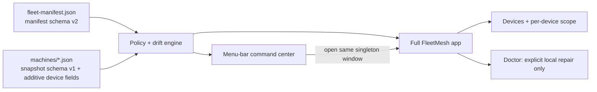

# FleetMesh

FleetMesh is Patrick's native fleet control plane for the devices that run his
personal engineering stack. It answers three practical questions with evidence:

1. What is installed and configured on each device?
2. How does that device differ from the explicit fleet baseline?
3. What can Doctor safely repair locally, and what needs a human decision?

The visible product is FleetMesh, but the compatibility identifiers intentionally
remain unchanged: bundle ID `dev.starkpat.devicesync`, executable/module
`DeviceSync`, component ID `device-sync`, snapshot field
`deviceSyncVersion`, `Device Sync` state and fleet folders, LaunchAgent label,
and status-item autosave name. Those identifiers are fleet continuity, not stale
branding.

## Native surfaces

FleetMesh has two native surfaces backed by one live store:

- A menu-bar command center for posture, freshness, counts, and one-click local
  scan. Closing the full window does not quit FleetMesh; the menu-bar item stays
  alive until **Quit FleetMesh** is chosen.
- A singleton full app for device inventory, fleet defaults, per-device scope,
  bootstrap planning, and Doctor's guarded repair workflow.



## Device model

FleetMesh now treats the fleet as devices, not just Macs. A device has:

- platform: macOS, Linux, or unknown
- role: workstation, server, or cloud desktop
- capabilities: GUI, Mac apps, menu bar, launchd, systemd, shell, and config
  files
- enrollment: Pending, In fleet, or Removed
- per-device item scope: Inherit, Required, or Excluded

Discovery is not authorization. A newly seen machine can publish redacted
evidence, but it remains Pending until explicitly enrolled. Removed devices stay
visible as history and missing evidence, but they do not drive fleet health.

Per-device scope lets one baseline support unlike machines. For example, a Mac
workstation can inherit Stow, AuthBar, Kiro Crew, and menu-bar expectations,
while a Linux cloud desktop can require ai-continuum, Codex CLI, and
harness-sync but mark Mac-only apps as not applicable. Incompatible inherited
items are shown truthfully as not applicable rather than as drift.

## Fleet defaults and managed items

Fleet defaults live in `fleet-manifest.json`. They define the managed catalog,
desired versions or fingerprints, device enrollment, roles, and per-device
overrides. Changing fleet defaults, enrolling or removing a device, and marking
an item Required or Excluded are explicit desired-state actions.

Codex Voice remains observable evidence, but it is outside the managed daily
baseline. FleetMesh should not uninstall it or repair it as part of normal fleet
posture.

Kiro Crew is the active managed agent product. MeshClaw is retired; older
`meshclaw-themes` evidence is ignored instead of being treated as current Kiro
Crew state.

## Remote check-in

FleetMesh can add a Linux device over SSH using a local-only endpoint record.
The endpoint or SSH alias is stored only in this Mac's legacy local Application
Support state so this controller can check the device in again. It is never
written to `fleet-manifest.json` or any shared machine snapshot.

Remote inventory uses the system `/usr/bin/ssh`, the user's existing SSH config
and agent, strict destination validation, and a fixed bounded read-only probe.
FleetMesh never executes commands from synced JSON and never repairs a remote
device.

## Privacy contract

The shared fleet folder contains small, atomic, human-readable JSON only:

```text
Device Sync/
├── fleet-manifest.json
└── machines/
    ├── <random-machine-id>.json
    └── ...
```

Machine IDs are random local IDs. Shared JSON must not contain serial numbers,
hardware UUIDs, usernames, home paths, SSH endpoints, secrets, cookies, tokens,
Keychain material, raw configuration, SQLite/WAL files, sockets, or live
database copies. Missing or unreadable evidence is reported as unknown/missing,
never assumed healthy.

The default shared folder is
`~/Library/CloudStorage/OneDrive-amazon.com/Device Sync` when that OneDrive
root exists. Otherwise FleetMesh uses its local Application Support folder until
the user points it at the shared fleet folder. On a new Mac, make OneDrive
available before first authoritative scan so FleetMesh reads the existing
manifest instead of asking to seed a new baseline.

## Doctor

Doctor is a local repair safety gate, not an autonomous fleet mutator. A repair
requires an explicit user action, a fresh preflight snapshot, a built-in
product-owned repair entrypoint, and a postflight snapshot. Command exit zero is
not proof; FleetMesh reports the observed result after the repair.

Doctor will not repair remote devices, execute commands from the manifest,
overwrite dirty source or themes, switch unapproved revisions, replace a theme,
or change the baseline as part of a repair.

## Run and test

```bash
DEVELOPER_DIR=/Applications/Xcode.app/Contents/Developer swift run DeviceSync
DEVELOPER_DIR=/Applications/Xcode.app/Contents/Developer swift test
./install.sh
```

Headless verification:

```bash
/Applications/FleetMesh.app/Contents/MacOS/DeviceSync --check
/Applications/FleetMesh.app/Contents/MacOS/DeviceSync --snapshot
/Applications/FleetMesh.app/Contents/MacOS/DeviceSync --adopt-baseline
/Applications/FleetMesh.app/Contents/MacOS/DeviceSync --add-to-scope <component-id>
/Applications/FleetMesh.app/Contents/MacOS/DeviceSync --remove-from-scope <component-id>
```

The installer registers a per-user LaunchAgent that publishes this device's
snapshot at login and every six hours. Scheduled publication can update only
this device's snapshot; it cannot change desired state or execute convergence.

See [docs/ARCHITECTURE.md](docs/ARCHITECTURE.md) for ownership and failure
semantics, and [docs/FLEET-PROTOCOL.md](docs/FLEET-PROTOCOL.md) for the JSON
contract.
