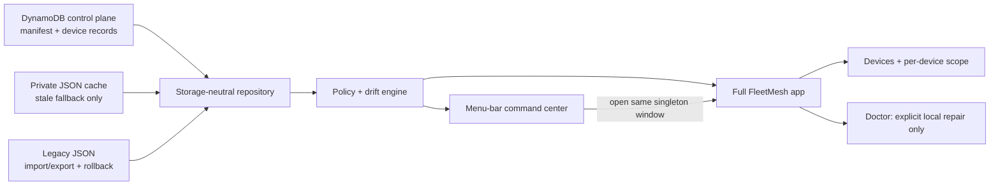

# FleetMesh

FleetMesh is Patrick's native fleet control plane for the devices that run his
personal engineering stack. It answers three practical questions with evidence:

1. What is installed and configured on each device?
2. How does that device differ from the explicit fleet baseline?
3. What can Doctor safely repair locally, and what needs a human decision?

The visible product is FleetMesh, but the compatibility identifiers intentionally
remain unchanged: bundle ID `dev.starkpat.devicesync`, executable/module
`DeviceSync`, component ID `device-sync`, snapshot field
`deviceSyncVersion`, `Device Sync` state and fleet folders, LaunchAgent label,
and status-item autosave name. Those identifiers are fleet continuity, not stale
branding.

## Native surfaces

FleetMesh has two native surfaces backed by one live store:

- A menu-bar command center for posture, freshness, counts, and one-click local
  scan. Closing the full window does not quit FleetMesh; the menu-bar item stays
  alive until **Quit FleetMesh** is chosen.
- A singleton full app for device inventory, fleet defaults, per-device scope,
  bootstrap planning, and Doctor's guarded repair workflow.

Managed software cards are themselves actionable. Selecting one expands an
inline panel without leaving Fleet posture. Repairable drift uses Doctor's same
fresh preflight, hard-coded product entrypoint, and postflight proof. Dirty
checkouts offer review only. Software tracks the latest verified product or
repository version automatically; an observed software version newer than an
older recorded minimum is healthy and never requires manual promotion.



## Device model

FleetMesh now treats the fleet as devices, not just Macs. A device has:

- platform: macOS, Linux, or unknown
- role: workstation, server, or cloud desktop
- capabilities: GUI, Mac apps, menu bar, launchd, systemd, shell, and config
  files
- enrollment: Pending, In fleet, or Removed
- per-device item scope: Inherit, Required, or Excluded

Discovery is not authorization. A newly seen machine can publish redacted
evidence, but it remains Pending until explicitly enrolled. Removed devices stay
visible as history and missing evidence, but they do not drive fleet health.

Per-device scope lets one baseline support unlike machines. For example, a Mac
workstation can inherit Stow, AuthBar, Harness Sync, Kiro Crew, and menu-bar
expectations, while a Linux cloud desktop can require ai-continuum, Codex CLI,
Kiro Crew, and Kiro Crew themes. Kiro Crew is a managed desktop app on macOS
and a toolbox-owned gateway service on Linux. Incompatible inherited items are
shown truthfully as not applicable rather than as drift.

## Fleet defaults and managed items

Fleet defaults live in the control plane's logical manifest record. DynamoDB is
the active authority; `fleet-manifest.json` remains the compatible import,
export, private-cache, and rollback representation. The manifest defines the
managed catalog, desired versions or fingerprints, device enrollment, roles,
and per-device overrides. Changing fleet defaults, enrolling or removing a
device, and marking an item Required or Excluded are explicit desired-state
actions with conditional revision checks.

Managed software posture compares the installed version with a product-owned
latest-version source when one is available. Murmr Voice, for example, uses its
signed Sparkle appcast. Products without a machine-readable release check use the
manifest's **Recorded minimum** conservatively. A failed product check is Unknown,
not healthy.

Routine scans never inspect developer Git checkouts for software. Branch,
revision, dirty worktrees, and installed/source commit equality cannot create
fleet drift or redefine a version target. Checkout inspection occurs only after
an explicit source-based Doctor repair request, where it is a safety preflight
that can block a dirty, changed, or downgrade-prone installer. Shared machine
reports never contain those Doctor-only checkout details. Exact configuration
and theme fingerprints remain explicit desired state.

Codex Voice remains observable evidence, but it is outside the managed daily
baseline. FleetMesh should not uninstall it or repair it as part of normal fleet
posture.

An observed item outside fleet scope can also be hidden from the local
Available list. This reversible presentation preference lives only in this
Mac's `local-state.json`; it does not alter the manifest, suppress inventory,
uninstall software, or affect another device. Hidden items remain recoverable
from the collapsed **Hidden items** section in Settings.

Kiro Crew is the active managed agent product. MeshClaw is retired; older
`meshclaw-themes` evidence is ignored instead of being treated as current Kiro
Crew state.

## Remote check-in

FleetMesh can add a Linux device over SSH using a local-only endpoint record.
The endpoint or SSH alias is stored only in this Mac's local Application
Support state so this controller can check the device in again. It is never
written to the logical manifest, a shared device payload, or DynamoDB.

Remote inventory uses the system `/usr/bin/ssh`, the user's existing SSH config
and agent, strict destination validation, and a fixed bounded read-only probe.
Selecting a connected Linux device in Doctor exposes **Diagnose <device>**, which
reuses that same probe and publishes fresh redacted evidence in place. FleetMesh
never executes commands from synced JSON and never repairs a remote device.

## Privacy contract

The shared control plane contains one manifest record and one current record per
random machine ID:

```text
FLEET#<fleet-id>  / STATE  — desired-state manifest
DEVICE#<uuid>     / STATE  — redacted device evidence
GSI1: FLEET#<fleet-id>     — complete fleet view
```

Machine IDs are random local IDs. DynamoDB payloads and the private JSON cache
must not contain serial numbers, hardware UUIDs, usernames, home paths, SSH
endpoints, credentials, cookies, tokens, Keychain material, raw configuration,
source branch or worktree state, SQLite/WAL files, sockets, or live database
copies. Missing or unreadable evidence is reported as unknown/missing, never
assumed healthy.

AWS credentials come from a selected local profile. FleetMesh stores only the
profile name, Region, table, fleet ID, and cache path in local state; it never
stores credentials in fleet records. Runtime roles are separated into reader,
reporter, and controller policies. The reporter can write only `DEVICE#*`
partitions, while policy changes require the controller role.

Legacy OneDrive JSON remains available for one-time import, explicit export,
and rollback evidence. The guarded migration command imports idempotently,
compares canonical manifest and device hashes, and persists shadow or DynamoDB
mode only after an exact match.

On a new Mac:

1. On an enrolled controller, open **Devices → Invite Mac** and save the
   credential-free `.fleetmesh` invitation.
2. Install FleetMesh on the new Mac and open the invitation, or choose
   **Join with invitation…** in the automatically presented first-run wizard.
3. Confirm the local least-privilege reporter profile and machine name, then
   choose **Connect this Mac**. FleetMesh imports only non-secret selectors,
   validates the profile through the normal AWS provider chain, reads the
   existing manifest, and publishes redacted evidence as Pending.
4. Back on the controller, open **Devices**, review the Pending report, choose
   the device role, and approve **Add to fleet**.
5. Refresh the new Mac and continue to Bootstrap for any required installations
   or updates.

The invitation contains no credentials, account ID, controller profile, machine
identity, SSH endpoint, cache path, or manifest. Do not copy `local-state.json`
between Macs. An invitation configures connection metadata but grants no AWS
access; temporary reporter credentials must already resolve locally.

FleetMesh never creates or replaces a baseline during an ordinary scan. If the
manifest is missing or unreadable, it reports the authority failure and waits.
Creating a new fleet requires the explicit baseline action; migration and
cutover require the explicit `--migrate-dynamodb` command and optional
`--cutover` flag.

## Doctor

Doctor is a local repair safety gate, not an autonomous fleet mutator. A repair
requires an explicit user action, a fresh preflight snapshot, a built-in
product-owned repair entrypoint, and a postflight snapshot. Command exit zero is
not proof; FleetMesh reports the observed result after the repair.

Doctor will not repair remote devices, execute commands from the manifest,
overwrite dirty source or themes, switch unapproved revisions, replace a theme,
or change the baseline as part of a repair.

When a managed configuration checkout contains local work, Doctor does not leave
the user at a dead end. **Resolve with Codex** starts a persistent visible task rooted at the
known checkout with a fixed preservation-first brief; **Review changes** reveals
the checkout; and **Scan again** re-evaluates it afterward. The recommended order
is to review, test, and commit intentional durable changes first. Rebaselining is
never used to hide a dirty checkout. If the clean committed configuration later
differs from desired state, baseline adoption remains a separate explicit action.
Doctor treats that clean committed difference as an operator decision, never as
a reason to run `bootstrap.sh`; the observed fingerprint changes desired state
only through the confirmed **Use observed as baseline…** action.

FleetMesh keeps the authenticated Codex agent in the background so it does not
take over the desktop. It reports success only after the real task finishes,
then renders that task's final summary and selectable ID inside FleetMesh; it
does not automatically open or read another app. The Codex handoff may prepare a focused local branch and commit tested intentional
work. It may not reset, clean, stash, amend, force-push, discard uncertain files,
push, create or merge a pull request, or run a configuration-changing bootstrap
without separate authorization in that task.

## Run and test

```bash
DEVELOPER_DIR=/Applications/Xcode.app/Contents/Developer swift run DeviceSync
DEVELOPER_DIR=/Applications/Xcode.app/Contents/Developer swift test
./install.sh
```

Headless verification:

```bash
/Applications/FleetMesh.app/Contents/MacOS/DeviceSync --check
/Applications/FleetMesh.app/Contents/MacOS/DeviceSync --self-check
/Applications/FleetMesh.app/Contents/MacOS/DeviceSync --snapshot
/Applications/FleetMesh.app/Contents/MacOS/DeviceSync --diagnose-remote <device-name-or-id>
/Applications/FleetMesh.app/Contents/MacOS/DeviceSync --adopt-baseline
/Applications/FleetMesh.app/Contents/MacOS/DeviceSync --use-observed-baseline <component-id>
/Applications/FleetMesh.app/Contents/MacOS/DeviceSync --add-to-scope <component-id>
/Applications/FleetMesh.app/Contents/MacOS/DeviceSync --remove-from-scope <component-id>
```

`--check` prints the fleet-wide count plus one bounded finding line per stale,
missing, unknown, or drifting managed item. `--diagnose-remote` runs only the
fixed read-only SSH inventory probe for a configured private device and
publishes redacted evidence. `--use-observed-baseline` requires a fresh clean
local configuration or theme observation and performs a conditional manifest
write; it never installs software or repairs a remote device.

The installer registers a per-user LaunchAgent that publishes this device's
snapshot at login and every six hours. Scheduled publication can update only
this device's snapshot; it cannot change desired state or execute convergence.

See [docs/ARCHITECTURE.md](docs/ARCHITECTURE.md) for ownership and failure
semantics, and [docs/FLEET-PROTOCOL.md](docs/FLEET-PROTOCOL.md) for the JSON
contract.
