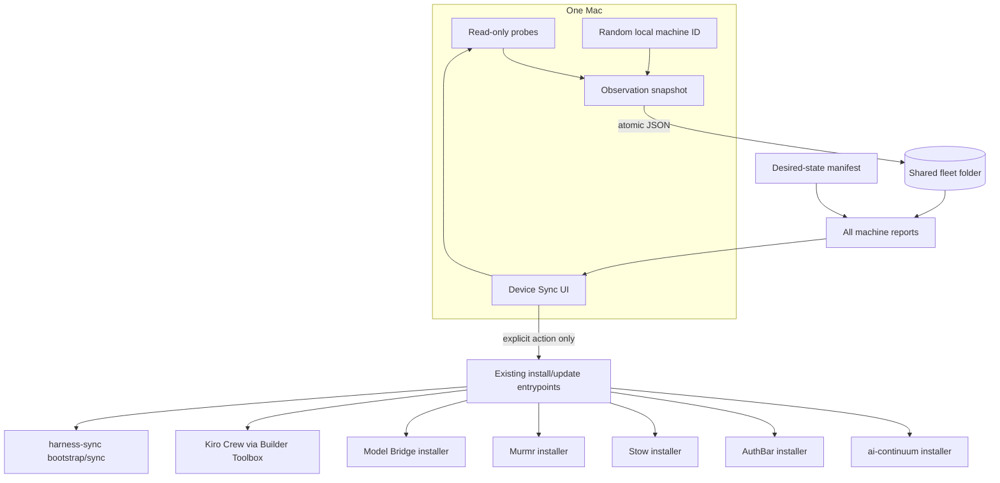

# Architecture

## Verdict

Device Sync is a control plane, not a second installer framework. It observes
real installed artifacts, stores only redacted fleet evidence, calculates
drift against one baseline, and delegates convergence to the component that
already owns it.

## Sources of truth

| Concern | Authority |
|---|---|
| Desired fleet versions | `fleet-manifest.json` |
| What a Mac actually has | Fresh read-only probes on that Mac |
| Product installation and runtime state | The product's own installer/runtime |
| Claude and OMP linked config | `~/harness-sync` |
| AI continuity databases | ai-continuum local storage |
| Durable human/agent context | BrainVault/StarkBrain and repository docs |

## Failure semantics

- A missing snapshot is not a healthy machine; it is absent evidence.
- A stale snapshot is shown as stale even if its last versions matched.
- A malformed machine JSON file remains visible as a fleet issue.
- A missing baseline produces `unknown`, not an invented target.
- Source checkout revision and installed artifact revision are separate. Local
  source changes are surfaced but never copied, reset, pulled, or installed.
- Component retirement is explicit. MeshClaw evidence from older writers is
  ignored; Kiro Crew's managed package, signed app, runtime, and native themes
  are the active fleet surfaces.
- Cloud-folder unavailability falls back only when no shared path is configured.
  Once a user chooses a fleet folder, failure is reported rather than silently
  writing to a different authority.
- The installed per-user LaunchAgent publishes at login and every six hours.
  Scheduled publication can update only this Mac's snapshot; it cannot change
  the baseline or execute a convergence action.

## Bootstrap boundary

The setup screen is a plan and orchestration surface. A future execution
engine should use typed, product-owned actions with preview, confirmation,
streamed logs, timeout, rollback evidence, and post-install probes. It must not
turn shell snippets in a synced manifest into executable code.
