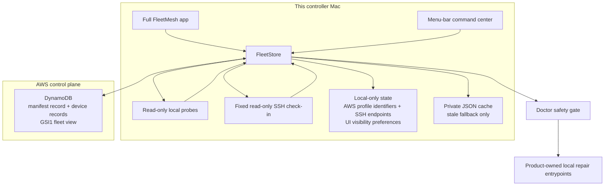

# Architecture

## Verdict

FleetMesh is a device fleet control plane, not a second installer framework.
It observes real installed artifacts, stores only redacted fleet evidence,
calculates drift against explicit desired state, and delegates convergence to
the component that already owns the install or update lifecycle.

## Sources of truth

| Concern | Authority |
|---|---|
| Desired fleet catalog, versions, enrollment, roles, and scope | DynamoDB manifest record (`FLEET#<fleet-id>` / `STATE`); JSON is import/export/cache compatibility |
| What a device actually has | Fresh read-only probes from that device |
| Product installation and runtime state | The product's own installer/runtime |
| Latest supported software version | Product-owned update feed/checker, else recorded minimum |
| Linux SSH reachability from this controller Mac | Local Application Support state only |
| Hidden Available-item preferences | Local Application Support state only |
| Claude and OMP linked config | `~/harness-sync` |
| AI continuity databases | ai-continuum local storage |
| Durable human/agent knowledge | BrainVault/StarkBrain and repository docs |

A machine report never defines the baseline. A scheduled snapshot never changes
desired state. Installing, updating, enrolling, removing, repairing, replacing a
theme, or changing fleet defaults requires an explicit user action.

Doctor treats DDB as declarative policy, never executable input. The manifest may
select an exact configuration fingerprint or source revision, but component IDs
are resolved only through FleetMesh's compiled-in repair catalog. Product
commands remain hard-coded. Managed theme assets ship inside the signed app,
are size/type/path bounded, and must reproduce DDB's full SHA-256 aggregate
before staging. Existing theme directories move to private Doctor Backups before
replacement, and a failed installed fingerprint restores the prior directory.

Harness Sync repair validates its compiled-in GitLab origin, requires a clean
checkout, fetches non-interactively, resolves DDB's hex revision to a commit,
and proves the current commit is its ancestor. The only permitted worktree
mutation is `git merge --ff-only <verified-commit>` followed by the owner
bootstrap. No reset, checkout, clean, arbitrary URL, manifest command, or silent
baseline change is part of Fix It. The manifest revision and observed source or
fingerprint are pinned immediately before execution, then every repair publishes
a fresh snapshot and counts as verified only when drift is aligned.

## Fleet model

FleetMesh separates device discovery from enrollment. A report can appear before
the device is authorized for fleet health. The device policy in manifest schema
v2 then decides whether the device is Pending, In fleet, or Removed.

Device attributes are intentionally broad enough for macOS workstations, Linux
servers, and cloud desktops:

- platform: macOS, Linux, or unknown
- role: workstation, server, or cloud desktop
- capabilities: GUI, Mac apps, menu bar, launchd, systemd, shell, and config
  files
- component policy: Inherit, Required, or Excluded per device

### New Mac enrollment

A controller may export a schema-versioned `.fleetmesh` invitation containing
only non-secret DynamoDB selectors, a reporter-profile hint, creation time, and
a suggested role. The artifact is configuration, not authorization: it carries
no credential, token, account ID, machine ID, endpoint, cache path, manifest, or
controller profile.

The new Mac imports the invitation atomically into local state while preserving
its independently generated machine ID. FleetMesh then uses the normal profile
resolver and refresh path. It must read an existing manifest before it can
publish a redacted report, and that report remains Pending. Only an already
enrolled controller can mutate the manifest to approve membership and role. An
invitation can never create or replace a baseline, enroll its recipient, or run
Bootstrap or Doctor actions.

#### Moving between fleets

A different valid invitation produces an explicit move operation, never a
silent authority replacement. FleetMesh constructs an independent destination
backend and requires a live readable manifest before mutating either local or
old-fleet state. It then conditionally marks the local machine Removed in the
old manifest, persists destination selectors while preserving machine identity
and private state, and publishes a newly captured redacted report as Pending.

Destination preflight and old-manifest conflict failures leave the current
fleet unchanged. If destination publication fails after old-fleet departure,
the destination remains configured so Refresh can safely retry; FleetMesh
states that departure already succeeded. Private fallback caches are separated
by fleet ID and can never veto an authoritative DynamoDB write.

Applicability is evaluated before drift. A Mac-only target inherited by a Linux
server is not a failure; it is not applicable. A missing required shell/config
target on that Linux server is drift.

## Native surfaces

The menu bar and full window are two views over one in-process store. The menu
bar owns quick posture, counts, freshness, and local scan initiation. Fleet
inspection, device enrollment, fleet-default changes, bootstrap decisions, and
every Doctor repair remain in the singleton full window.

Closing the singleton window does not terminate FleetMesh. The native status
item remains the persistent control surface, and Dock activation or menu actions
reopen the same scene with bounded retries for asynchronous SwiftUI window
creation. Only **Quit FleetMesh** terminates the process.

The command center is anchored by a named native `NSStatusItem`. FleetMesh
seeds only its own initial placement preference and preserves later user
placement; it never rearranges another app's menu-bar item.

### Updates and release notes

The installed bundle includes the same `CHANGELOG.md` whose first entry gates
release packaging, so What's New remains available without a source checkout.
In-app updates use only versioned GitHub Release assets from the fixed
`pstarkgit/FleetMesh` repository. Receiving Macs never compile FleetMesh and do
not need Git, a checkout, Xcode, Command Line Tools, or signing credentials.

The release publisher builds once from a clean reviewed commit, stamps the full
commit/repository/architecture into signed `Info.plist`, signs with Developer ID
and a secure timestamp, submits to Apple notarization, staples the ticket,
verifies Gatekeeper, then emits an architecture-specific ZIP, bounded JSON
manifest, full SHA-256 and size, and CycloneDX SBOM. GitHub release audit history
controls publication. The signed app is the trust root; mutable release metadata
cannot authorize an app that fails Developer ID, Team ID, timestamp, Gatekeeper,
stapling, bundle identity, provenance, version, commit, or architecture checks.

An explicit Update action downloads into a private cache, validates all gates,
and launches only `install-prebuilt.sh` from inside the already verified signed
app. The helper independently repeats trust checks, waits for the old process,
backs up the current bundle, moves the prebuilt app into `/Applications`, runs
its self-check, rolls back if proof fails, refreshes FleetMesh's own LaunchAgent,
and relaunches. No downloaded command, shell fragment, repository URL, DDB value,
or manifest path becomes executable input. Private bounded logs remain local.

## Managed product boundaries

FleetMesh owns the storage-neutral desired-state protocol, DynamoDB control-plane
adapter, redacted snapshots, private JSON cache/import compatibility, drift
calculation, bootstrap orchestration UI, local-only SSH check-in, and Doctor's
hard-coded local repair catalog.

Each managed product owns its own installer, updater, runtime state, and health
semantics. FleetMesh may invoke those entrypoints only from explicit UI actions;
it does not duplicate them in the fleet protocol.

Current product boundaries:

- ai-continuum owns its SQLite databases and runtime health.
- AuthBar owns its app, agents, and auth semantics.
- Stow owns window/menu-bar layout behavior.
- Murmr Voice owns its signed/notarized distribution, Sparkle update feed,
  runtime, and macOS permission state. FleetMesh may compare its installed
  bundle version with the feed and link to product distribution, but never run
  the developer-only `~/code/Murmur/install.sh` as product repair.
- Model Bridge owns its own app/runtime checks.
- Kiro Crew is the active managed agent product; Builder Toolbox owns its
  installation and update lifecycle.
- MeshClaw is retired and must not be treated as current Kiro Crew evidence.
- Codex Desktop and Codex CLI remain observable/managed where in scope.
- Codex Voice remains installed/observable evidence but is outside the managed
  daily baseline.
- `~/harness-sync` owns recurring Claude/OMP configuration linking on Mac sync
  peers; FleetMesh reports and orchestrates it there but does not rewrite files
  it owns. Linux cloud desktops are setup targets, not Harness Sync peers, and
  any Linux-specific backup scripts remain separate operational artifacts.

## Rename compatibility

FleetMesh is the visible product and `/Applications/FleetMesh.app` is its
canonical installation. Existing compatibility authorities remain unchanged:
bundle ID `dev.starkpat.devicesync`, executable/module `DeviceSync`,
component ID `device-sync`, JSON field `deviceSyncVersion`, `Device Sync`
Application Support/shared-fleet folders, LaunchAgent
`dev.starkpat.devicesync.snapshot`, and status-item autosave name
`DeviceSync`. These are migration boundaries and must be preserved.

## Failure semantics

- Missing evidence is unknown or missing, never healthy.
- A stale snapshot is stale even if the last observed versions matched.
- A malformed machine JSON file remains visible as a fleet issue.
- A missing manifest means there is no known desired state; FleetMesh must not
  invent one except through explicit first-run seeding.
- A pending device does not affect health until enrolled.
- A removed device remains visible without driving drift, Bootstrap work, or
  Doctor action.
- Software source checkouts are not part of fleet posture or shared snapshots.
  Doctor may inspect a checkout only after an explicit source-repair request;
  local changes are never copied, reset, pulled, or installed over.
- Component retirement is explicit. MeshClaw evidence from older writers is
  ignored; Kiro Crew package/runtime/theme evidence is current.
- Cloud-folder unavailability falls back only when no shared path is configured.
  Once a user chooses a fleet folder, failure is reported rather than silently
  writing to a different authority.
- The per-user LaunchAgent can publish only this device's snapshot. It cannot
  change the manifest or execute a convergence action.

## Doctor boundary

Bootstrap is the full new-device sequence and Doctor separates diagnosis from
mutation. For this Mac, Doctor is the local repair executor. For a connected
Linux device, Doctor may refresh evidence only by reusing the same typed,
bounded, fixed SSH probe as device check-in. Remote repair remains prohibited.
Doctor uses typed, built-in product actions with command preview, explicit
confirmation, bounded execution, private local output capture, and mandatory
postflight probes. It never turns shell snippets or other values from synced
JSON into executable code.

Before execution, Doctor publishes a fresh installed-state snapshot and
re-evaluates the exact component. For source-based recipes it separately checks
the local checkout and stops on dirty, changed, or downgrade-prone source,
remote targets, unknown evidence, missing entrypoints, and manual theme or
identity decisions. Checkout details stay local and are not published. After
execution, it publishes another fresh snapshot. Exit
zero is not success by itself: the UI reports verified alignment, machine repair
with a separate baseline decision, or remaining attention from observed state.

Protected configuration work uses a visible resolution handoff, not an implicit
mutation. FleetMesh starts a persistent Codex task scoped to its hard-coded known
checkout with a fixed preservation-first prompt, reveal that checkout, or scan
again. It keeps ownership of the background process through `turn.completed`
and clean exit, then renders the bounded final agent summary and selectable task
ID inside FleetMesh. This avoids interrupting an active CLI-owned turn, stealing
desktop focus, or requesting cross-app data access. The prompt may authorize a tested local commit while keeping destructive
cleanup, push, PR, merge, bootstrap/sync, and baseline changes separately gated.
No prompt, path, or command is read from fleet JSON.

After the checkout becomes clean, an exact committed configuration mismatch is
a baseline decision rather than a repair. Doctor suppresses the product bootstrap
recipe and offers an explicit confirmed observed-baseline action; ordinary scans
and Codex completion never invoke it.
