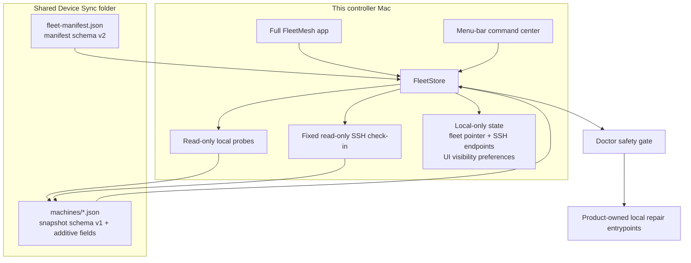

# Architecture

## Verdict

FleetMesh is a device fleet control plane, not a second installer framework.
It observes real installed artifacts, stores only redacted fleet evidence,
calculates drift against explicit desired state, and delegates convergence to
the component that already owns the install or update lifecycle.

## Sources of truth

| Concern | Authority |
|---|---|
| Desired fleet catalog, versions, enrollment, roles, and scope | `fleet-manifest.json` |
| What a device actually has | Fresh read-only probes from that device |
| Product installation and runtime state | The product's own installer/runtime |
| Latest supported software version | Product-owned update feed/checker, else recorded minimum |
| Linux SSH reachability from this controller Mac | Local Application Support state only |
| Hidden Available-item preferences | Local Application Support state only |
| Claude and OMP linked config | `~/harness-sync` |
| AI continuity databases | ai-continuum local storage |
| Durable human/agent knowledge | BrainVault/StarkBrain and repository docs |

A machine report never defines the baseline. A scheduled snapshot never changes
desired state. Installing, updating, enrolling, removing, repairing, replacing a
theme, or changing fleet defaults requires an explicit user action.

## Fleet model

FleetMesh separates device discovery from enrollment. A report can appear before
the device is authorized for fleet health. The device policy in manifest schema
v2 then decides whether the device is Pending, In fleet, or Removed.

Device attributes are intentionally broad enough for macOS workstations, Linux
servers, and cloud desktops:

- platform: macOS, Linux, or unknown
- role: workstation, server, or cloud desktop
- capabilities: GUI, Mac apps, menu bar, launchd, systemd, shell, and config
  files
- component policy: Inherit, Required, or Excluded per device

Applicability is evaluated before drift. A Mac-only target inherited by a Linux
server is not a failure; it is not applicable. A missing required shell/config
target on that Linux server is drift.

## Native surfaces

The menu bar and full window are two views over one in-process store. The menu
bar owns quick posture, counts, freshness, and local scan initiation. Fleet
inspection, device enrollment, fleet-default changes, bootstrap decisions, and
every Doctor repair remain in the singleton full window.

Closing the singleton window does not terminate FleetMesh. The native status
item remains the persistent control surface, and Dock activation or menu actions
reopen the same scene with bounded retries for asynchronous SwiftUI window
creation. Only **Quit FleetMesh** terminates the process.

The command center is anchored by a named native `NSStatusItem`. FleetMesh
seeds only its own initial placement preference and preserves later user
placement; it never rearranges another app's menu-bar item.

## Managed product boundaries

FleetMesh owns desired-state JSON, redacted snapshots, drift calculation,
bootstrap orchestration UI, local-only SSH check-in, and Doctor's hard-coded
local repair catalog.

Each managed product owns its own installer, updater, runtime state, and health
semantics. FleetMesh may invoke those entrypoints only from explicit UI actions;
it does not duplicate them in the fleet protocol.

Current product boundaries:

- ai-continuum owns its SQLite databases and runtime health.
- AuthBar owns its app, agents, and auth semantics.
- Stow owns window/menu-bar layout behavior.
- Murmr Voice and Model Bridge own their own app/runtime checks.
- Kiro Crew is the active managed agent product; Builder Toolbox owns its
  installation and update lifecycle.
- MeshClaw is retired and must not be treated as current Kiro Crew evidence.
- Codex Desktop and Codex CLI remain observable/managed where in scope.
- Codex Voice remains installed/observable evidence but is outside the managed
  daily baseline.
- `~/harness-sync` owns recurring Claude/OMP configuration linking; FleetMesh
  reports and orchestrates it but does not rewrite files it owns.

## Rename compatibility

FleetMesh is the visible product and `/Applications/FleetMesh.app` is its
canonical installation. Existing compatibility authorities remain unchanged:
bundle ID `dev.starkpat.devicesync`, executable/module `DeviceSync`,
component ID `device-sync`, JSON field `deviceSyncVersion`, `Device Sync`
Application Support/shared-fleet folders, LaunchAgent
`dev.starkpat.devicesync.snapshot`, and status-item autosave name
`DeviceSync`. These are migration boundaries and must be preserved.

## Failure semantics

- Missing evidence is unknown or missing, never healthy.
- A stale snapshot is stale even if the last observed versions matched.
- A malformed machine JSON file remains visible as a fleet issue.
- A missing manifest means there is no known desired state; FleetMesh must not
  invent one except through explicit first-run seeding.
- A pending device does not affect health until enrolled.
- A removed device remains visible without driving drift, Bootstrap work, or
  Doctor action.
- Software source checkouts are not part of fleet posture or shared snapshots.
  Doctor may inspect a checkout only after an explicit source-repair request;
  local changes are never copied, reset, pulled, or installed over.
- Component retirement is explicit. MeshClaw evidence from older writers is
  ignored; Kiro Crew package/runtime/theme evidence is current.
- Cloud-folder unavailability falls back only when no shared path is configured.
  Once a user chooses a fleet folder, failure is reported rather than silently
  writing to a different authority.
- The per-user LaunchAgent can publish only this device's snapshot. It cannot
  change the manifest or execute a convergence action.

## Doctor boundary

Bootstrap is the full new-device sequence and Doctor is the local repair
executor. Doctor uses typed, built-in product actions with command preview,
explicit confirmation, bounded execution, private local output capture, and
mandatory postflight probes. It never turns shell snippets or other values from
synced JSON into executable code.

Before execution, Doctor publishes a fresh installed-state snapshot and
re-evaluates the exact component. For source-based recipes it separately checks
the local checkout and stops on dirty, changed, or downgrade-prone source,
remote targets, unknown evidence, missing entrypoints, and manual theme or
identity decisions. Checkout details stay local and are not published. After
execution, it publishes another fresh snapshot. Exit
zero is not success by itself: the UI reports verified alignment, machine repair
with a separate baseline decision, or remaining attention from observed state.
