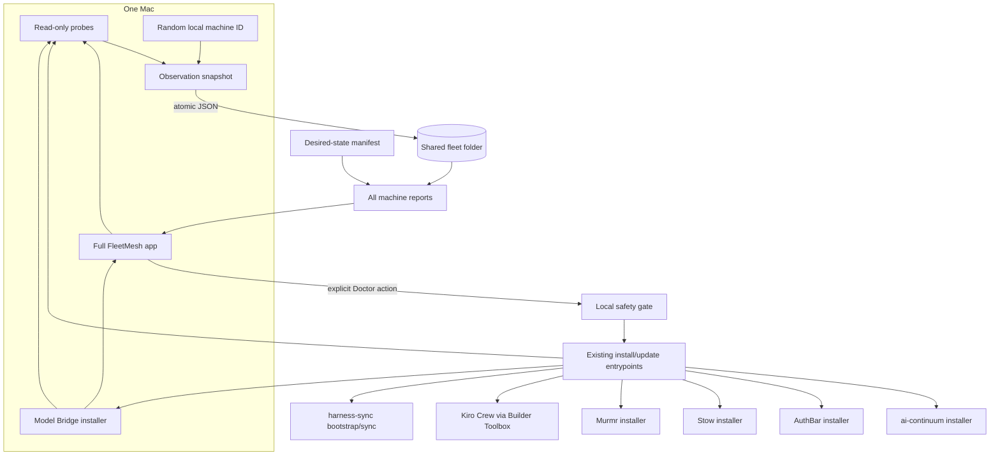

# Architecture

## Verdict

FleetMesh is a control plane, not a second installer framework. It observes
real installed artifacts, stores only redacted fleet evidence, calculates
drift against one baseline, and delegates convergence to the component that
already owns it.

## Sources of truth

| Concern | Authority |
|---|---|
| Desired fleet versions | `fleet-manifest.json` |
| What a Mac actually has | Fresh read-only probes on that Mac |
| Product installation and runtime state | The product's own installer/runtime |
| Claude and OMP linked config | `~/harness-sync` |
| AI continuity databases | ai-continuum local storage |
| Durable human/agent context | BrainVault/StarkBrain and repository docs |

On a new Mac, the OneDrive-backed fleet folder must be available before the
first authoritative scan. FleetMesh then reads `fleet-manifest.json` for the
in-scope catalog and desired versions, creates a new random local machine ID,
and publishes that Mac's observed evidence under `machines/`. A machine report
never defines scope, and a scheduled snapshot never replaces the manifest.

## Native surfaces

The menu bar and full window are two views over one in-process `FleetStore`.
The menu bar owns quick posture, counts, freshness, and local scan initiation.
Fleet inspection, baseline changes, bootstrap decisions, and every Doctor
repair remain in the singleton full window. Opening Fleet or Doctor from the
menu bar updates shared navigation before activating that window, so there is
no second dashboard or divergent repair state.

The command center is hosted in SwiftUI but anchored by a named native
`NSStatusItem`. FleetMesh seeds only its own initial placement preference and
preserves later user placement; it never rearranges another app's menu-bar item.

## Rename compatibility

FleetMesh is the visible product and `/Applications/FleetMesh.app` is its
canonical installation. Existing compatibility authorities remain unchanged:
bundle ID `dev.starkpat.devicesync`, executable `DeviceSync`, component ID
`device-sync`, JSON field `deviceSyncVersion`, `Device Sync` Application
Support/shared-fleet folders, LaunchAgent `dev.starkpat.devicesync.snapshot`,
and status-item autosave name `DeviceSync`. These are migration boundaries,
not stale branding to clean up.

## Failure semantics

- A missing snapshot is not a healthy machine; it is absent evidence.
- A stale snapshot is shown as stale even if its last versions matched.
- A malformed machine JSON file remains visible as a fleet issue.
- A missing baseline produces `unknown`, not an invented target.
- Source checkout revision and installed artifact revision are separate. Local
  source changes are surfaced but never copied, reset, pulled, or installed.
- Component retirement is explicit. MeshClaw evidence from older writers is
  ignored; Kiro Crew's managed package, signed app, runtime, and native themes
  are the active fleet surfaces.
- Cloud-folder unavailability falls back only when no shared path is configured.
  Once a user chooses a fleet folder, failure is reported rather than silently
  writing to a different authority.
- The installed per-user LaunchAgent publishes at login and every six hours.
  Scheduled publication can update only this Mac's snapshot; it cannot change
  the baseline or execute a convergence action.

## Bootstrap boundary

Bootstrap is the full new-Mac sequence and Doctor is the local repair executor.
Doctor uses typed, built-in product actions with command preview, explicit
confirmation, bounded execution, private local output capture, and mandatory
post-install probes. It never turns shell snippets or other values from the
synced manifest into executable code.

Before execution, Doctor publishes a fresh snapshot and re-evaluates the exact
component. It stops on remote targets, dirty source, unknown evidence, a source
revision outside the baseline, missing entrypoints, and manual theme or identity
decisions. After execution, it publishes another fresh snapshot. Exit zero is
not success by itself: the UI reports verified alignment, machine repair with a
separate baseline decision, or remaining attention from observed state.
