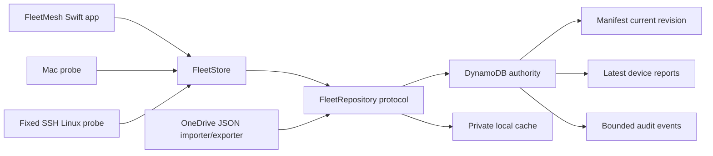

# FleetMesh DynamoDB Control Plane Design

Status: proposed migration plan

## Decision

Move FleetMesh's shared authority from OneDrive JSON to a dedicated DynamoDB
control plane, while retaining a private local cache for fast startup and
network or credential outages.

DynamoDB becomes authoritative only after a shadow-read, dual-write, and
rollback-tested migration. OneDrive remains an import/export and emergency
recovery source during the transition. Private SSH endpoints and controller
preferences always remain local and never enter DynamoDB.

## Goals

- Eliminate OneDrive synchronization races for manifest changes.
- Let macOS and Linux devices publish evidence directly from any location.
- Preserve optimistic concurrency for explicit fleet-policy changes.
- Keep FleetMesh usable for inspection while AWS or credentials are unavailable.
- Preserve the existing privacy contract and random machine identifiers.
- Provide bounded audit history without storing secrets or raw configuration.

## Non-goals

- DynamoDB does not authorize arbitrary remote repair.
- DynamoDB does not store SSH destinations, usernames, keys, tokens, cookies,
  raw settings, logs, source paths, or database files.
- The migration does not reuse the ai-continuum table.
- The migration does not delete the OneDrive fleet until rollback acceptance is
  complete.
- Offline policy mutation is not supported. Policy writes require an online,
  conditionally consistent DynamoDB transaction.

## Runtime architecture



The repository contract remains model-based:

```swift
protocol FleetRepositoryProtocol: Sendable {
    func load() async -> FleetReadResult
    func publish(_ snapshot: MachineSnapshot) async throws
    func saveManifest(
        _ manifest: FleetManifest,
        replacingRevision: String?
    ) async throws
}
```

Implementations:

- `JSONFleetRepository`: legacy import/export and test fixture.
- `DynamoDBFleetRepository`: authoritative remote store.
- `CachedFleetRepository`: DynamoDB plus private local read cache and queued
  device-report retry.

## DynamoDB table

Table name and Region are configuration, never hard-coded account identifiers.
Recommended defaults:

- table: `fleetmesh-control-plane`
- billing: on-demand
- encryption: DynamoDB encryption at rest
- point-in-time recovery: enabled
- deletion protection: enabled
- tags: `owner=starkpat`, `purpose=fleetmesh-control-plane`, `auto-delete=no`

### Primary keys

Use entity-specific partition keys so IAM can distinguish policy authority from
report-only writers.

| Entity | PK | SK | Purpose |
|---|---|---|---|
| Manifest | `FLEET#<fleet-id>` | `STATE` | Current desired state and revision |
| Device | `DEVICE#<machine-id>` | `STATE` | Latest redacted evidence from one device |
| Audit | `FLEET#<fleet-id>` | `EVENT#<ULID>` | Bounded policy and enrollment audit |

A GSI lists the current fleet without a table scan:

- `GSI1PK = FLEET#<fleet-id>`
- Manifest: `GSI1SK = 0#MANIFEST`
- Device: `GSI1SK = 1#DEVICE#<machine-id>`

### Item attributes

Manifest item:

- `entityType = manifest`
- `fleetID`
- `revision`
- `schemaVersion`
- `updatedAtEpochMs`
- `updatedByMachineID`
- `payloadJSON` containing the existing `FleetManifest` contract

Device item:

- `entityType = device`
- `fleetID`
- `machineID`
- `capturedAtEpochMs`
- `schemaVersion`
- `deviceSyncVersion`
- `payloadJSON` containing the existing redacted `MachineSnapshot` contract

Audit item:

- `entityType = audit`
- `eventID`
- `occurredAtEpochMs`
- `actorMachineID`
- `action`
- `previousRevision`
- `newRevision`
- `summary` with bounded non-secret metadata
- optional TTL after the agreed retention period

The latest manifest and latest device items must not use TTL.

## Concurrency and ordering

### Manifest writes

Manifest changes use a conditional write:

- create: `attribute_not_exists(revision)`
- update: `revision = :expectedRevision`

A failed condition maps to the existing stale-writer error and forces a reload.
No last-writer-wins policy mutation is allowed.

### Device writes

A device report may replace only an older report:

- `attribute_not_exists(capturedAtEpochMs) OR capturedAtEpochMs < :capturedAt`

The existing random machine ID remains the identity. A report never changes the
manifest, enrollment, or scope.

### Reads

- Strongly consistent `GetItem` for the manifest.
- Query `GSI1` for current device reports.
- Validate embedded schema versions and UUIDs exactly as the JSON repository
  does today.
- A malformed item becomes a visible `FleetIssue`, never healthy state.

## Local cache and offline behavior

Store the cache under FleetMesh Application Support with mode `0600` and parent
mode `0700`. It contains only the same redacted manifest and machine snapshots
allowed in the shared control plane.

Rules:

- Successful DynamoDB reads atomically replace the cache.
- If DynamoDB is unavailable, FleetMesh may display cached state as stale and
  explain that shared authority is offline.
- Device reports may queue locally and retry with their original capture time.
- Manifest, enrollment, role, and scope mutations fail closed while offline.
- The cache never stores AWS credentials or SSH endpoint data.

## IAM boundary

Use a dedicated FleetMesh profile and roles in Patrick's existing Isengard
account. Do not use an Admin role in the application.

Minimum capabilities:

- reader: `GetItem`, `Query` on the FleetMesh table and GSI.
- reporter: reader plus `PutItem` only for `DEVICE#*` partition keys.
- controller: reader plus conditional manifest and audit writes.

Use IAM `dynamodb:LeadingKeys` conditions where supported. Keep credentials in
the standard AWS provider chain. FleetMesh configuration stores only profile,
Region, table name, and fleet ID. The application must never read or display
credential files.

Credential expiry is a recoverable offline condition, not permission to fall
back to unguarded writes. The local cache keeps inspection available until the
standard credential provider can refresh.

## Configuration

Add local-only fields to `LocalDeviceState`:

- `storageBackend`: `json`, `shadow`, `dynamodb`
- `awsProfile`
- `awsRegion`
- `dynamoDBTable`
- `fleetID`
- `cachePath`

Defaults preserve the current JSON backend until migration is explicitly
started. None of these fields enter shared fleet state.

## Migration phases

### Phase 0: safety foundation

1. Introduce `FleetRepositoryProtocol` and async repository methods.
2. Keep `JSONFleetRepository` behavior byte-compatible.
3. Add deterministic payload hashing for manifest and report comparison.
4. Add backend selection with default `json`.

Acceptance: all existing tests pass unchanged against the JSON implementation.

### Phase 1: DynamoDB implementation

1. Add the pinned AWS SDK dependency and DynamoDB repository.
2. Implement model encoding, schema validation, conditional writes, and GSI
   reads.
3. Add in-memory fake DynamoDB tests for conditions and ordering.
4. Add least-privilege deployment documentation and table bootstrap script or
   infrastructure template.

Acceptance: repository contract tests pass against JSON and DynamoDB fakes.

### Phase 2: shadow read

1. Create the dedicated table with deletion protection and PITR.
2. Import the current OneDrive manifest and reports once.
3. Continue reading JSON as authority.
4. Read DynamoDB in shadow mode and compare canonical payload hashes.
5. Surface mismatches without changing user-visible fleet posture.

Acceptance: repeated scans report equal manifest/report hashes across both
stores and no unexpected device IDs.

### Phase 3: dual write

1. Keep JSON reads authoritative.
2. Write device reports to JSON and DynamoDB.
3. Write manifest changes to both only after the DynamoDB conditional write
   succeeds; roll back or report partial-write failure explicitly.
4. Run for an observation window spanning scheduled check-ins from every device.

Acceptance: zero divergence through the observation window, including a tested
stale-manifest conflict.

### Phase 4: DynamoDB authority

1. Switch reads to DynamoDB with cache fallback.
2. Keep a OneDrive export after successful shared writes.
3. Change the UI source label from shared folder to DynamoDB control plane.
4. Preserve a one-click rollback to `json` while no DynamoDB-only policy change
   has occurred, and a documented export-first rollback afterward.

Acceptance: Mac and dev-dsk independently publish and see each other's fresh
reports without relying on OneDrive synchronization.

### Phase 5: retire OneDrive authority

1. Keep dated exports for recovery.
2. Remove OneDrive from the normal read/write path.
3. Retain the importer for disaster recovery and local testing.

Acceptance: disabling OneDrive does not affect normal FleetMesh operation.

## Test plan

Repository contract tests:

- JSON and DynamoDB decode the same model payloads.
- Future schema versions become visible issues.
- Invalid machine IDs are rejected.
- Manifest stale writers fail conditional updates.
- Older device reports cannot overwrite newer evidence.
- Partial device corruption does not hide valid devices.
- GSI query returns exactly the fleet's manifest and current devices.

Cache tests:

- cache updates atomically after a successful remote read.
- offline read is visibly stale.
- offline report queues and retries without timestamp mutation.
- offline manifest mutation is blocked.
- cache contains no endpoint or credential fields.

Migration tests:

- OneDrive import is idempotent.
- shadow hashes match canonical JSON.
- dual-write failures are surfaced and recoverable.
- rollback preserves the newest manifest revision.
- no migration step invents a baseline.

Security tests:

- application code cannot issue table-wide scan.
- reporter cannot write the manifest partition key.
- no item contains SSH host, username, source path, token, cookie, or raw config.
- command execution remains fixed and independent of DynamoDB payloads.

## Deployment and rollback gates

Do not create or modify AWS resources until the implementation and fake-backed
contract tests pass.

Before cutover:

- verify caller identity without printing credentials.
- verify table, Region, PITR, deletion protection, encryption, and tags.
- export the current OneDrive manifest and reports.
- record manifest revision and canonical hashes.

Rollback:

- stop DynamoDB policy writes.
- export the newest DynamoDB manifest and reports.
- restore JSON backend only after revision comparison.
- never delete the table as part of rollback.

## Definition of done

- Dedicated table and least-privilege roles exist and are verified.
- All existing and new tests pass.
- Release build and installed self-check pass.
- Mac and dev-dsk publish directly and converge through DynamoDB.
- Conditional stale-writer behavior is proven live.
- Offline cache behavior is proven.
- OneDrive is no longer required for normal operation.
- PR is merged, the signed app is installed, and the migration evidence is
  documented without exposing credentials or private endpoints.
